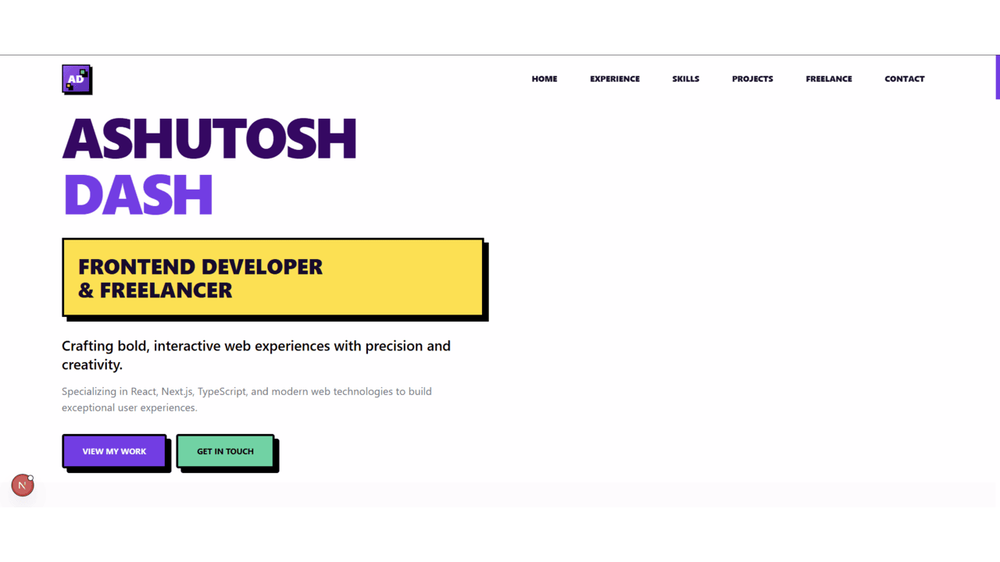
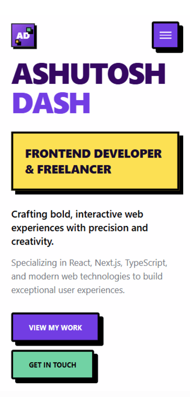

# 🚀 Ashutosh Dash - Portfolio Website

<div align="center">


**A modern, responsive portfolio website built with cutting-edge web technologies**

[Live Demo](#) • [Resume](/public/Ashutosh_Dash_Frontend_Dev.pdf) • [Contact](mailto:dashashutosh1999@gmail.com)

</div>

---

## 📖 About This Project

This is a **professional portfolio website** showcasing Ashutosh Dash's skills, experience, and projects as a Frontend Developer. Built with modern web technologies and following industry best practices, it demonstrates expertise in creating high-performance, accessible, and user-friendly web applications.

### ✨ Key Features

- 🎨 **Modern Design** - Clean, professional interface with smooth animations
- 📱 **Fully Responsive** - Optimized for all devices and screen sizes
- ⚡ **Performance Optimized** - Fast loading with Next.js 15 and Turbopack
- 🌐 **Internationalization** - Multi-language support (English, Spanish, French)
- ♿ **Accessibility First** - WCAG compliant with proper ARIA labels
- 🔍 **SEO Optimized** - Meta tags, sitemap, and structured data
- 📊 **Analytics Ready** - PostHog integration for user insights
- 📧 **Contact Form** - Functional contact system with Resend integration
- 📱 **PWA Ready** - Progressive Web App capabilities

---

## 🛠️ Tech Stack

### **Frontend Framework**

- **Next.js 15.4.6** - React framework with App Router
- **React 19.1.0** - Latest React with concurrent features
- **TypeScript 5.0** - Type-safe development

### **Styling & UI**

- **Tailwind CSS 4.0** - Utility-first CSS framework
- **Motion** - Smooth animations and transitions
- **Hugeicons** - Beautiful icon library

### **Development Tools**

- **ESLint** - Code quality and consistency
- **Prettier** - Code formatting
- **Husky** - Git hooks for pre-commit checks
- **Commitlint** - Conventional commit messages
- **SWC** - Fast compilation with console removal

### **Performance & Analytics**

- **Turbopack** - Next.js bundler for faster builds
- **PostHog** - Product analytics and user insights
- **Bundle Analyzer** - Bundle size optimization

### **Deployment & Hosting**

- **Vercel** - Optimized hosting platform
- **PWA Support** - Service worker and offline capabilities

---

## 🚀 Getting Started

### Prerequisites

- **Node.js** 18.0 or higher
- **pnpm** (recommended) or npm/yarn
- **Git** for version control

### Installation

1. **Clone the repository**

   ```bash
   git clone https://github.com/AshutoshDash1999/ashutosh-dash-portfolio.git
   cd ashutosh-dash-portfolio
   ```

2. **Install dependencies**

   ```bash
   pnpm install
   # or
   npm install
   # or
   yarn install
   ```

3. **Set up environment variables**

   ```bash
   cp .env.example .env.local
   ```

   Configure the following variables:

   ```env
   RESEND_API_KEY=your_resend_api_key
   POSTHOG_API_KEY=your_posthog_api_key
   POSTHOG_HOST=your_posthog_host
   ```

4. **Run the development server**

   ```bash
   pnpm dev
   # or
   npm run dev
   # or
   yarn dev
   ```

5. **Open your browser**
   Navigate to [http://localhost:3000](http://localhost:3000) to see your portfolio!

---

## 📁 Project Structure

```
src/
├── app/                    # Next.js App Router
│   ├── api/               # API routes
│   ├── globals.css        # Global styles
│   └── layout.tsx         # Root layout
├── components/            # Reusable components
│   ├── sections/          # Page sections
│   └── ui/               # UI components
├── data/                  # Static data (JSON files)
├── lib/                   # Utility functions
├── messages/              # i18n translations
└── utils/                 # Helper functions
```

---

## 🎯 Available Scripts

| Command             | Description                             |
| ------------------- | --------------------------------------- |
| `pnpm dev`          | Start development server with Turbopack |
| `pnpm build`        | Build for production                    |
| `pnpm start`        | Start production server                 |
| `pnpm lint`         | Run ESLint checks                       |
| `pnpm test`         | Run Jest tests                          |
| `pnpm prettier`     | Check code formatting                   |
| `pnpm prettier:fix` | Fix code formatting                     |
| `pnpm analyze`      | Analyze bundle size                     |

---

## 🏗️ Best Practices Followed

### **Code Quality**

- ✅ **TypeScript** for type safety
- ✅ **ESLint** with strict rules
- ✅ **Prettier** for consistent formatting
- ✅ **Husky** pre-commit hooks
- ✅ **Conventional commits** with commitlint

### **Performance**

- ✅ **Next.js 15** with App Router
- ✅ **Turbopack** for faster builds
- ✅ **Dynamic imports** for code splitting
- ✅ **Image optimization** with Next.js
- ✅ **Bundle analysis** and optimization

### **Accessibility**

- ✅ **WCAG 2.1** compliance
- ✅ **Semantic HTML** structure
- ✅ **ARIA labels** and roles
- ✅ **Keyboard navigation** support
- ✅ **Screen reader** compatibility

### **SEO & Analytics**

- ✅ **Meta tags** and Open Graph
- ✅ **Sitemap** generation
- ✅ **Robots.txt** configuration
- ✅ **PostHog** analytics integration
- ✅ **Performance monitoring**

### **Security**

- ✅ **Environment variables** for secrets
- ✅ **Input validation** with Zod
- ✅ **CSRF protection** in forms
- ✅ **Secure headers** configuration

---

## 📱 Screenshots

### Desktop View

<!-- Add your desktop screenshot here -->



### Mobile View

<!-- Add your mobile screenshot here -->



---

## 🌟 Features in Detail

### **Hero Section**

- Professional introduction
- Call-to-action buttons
- Smooth scroll navigation

### **Work Experience**

- Timeline-based layout
- Company information
- Role descriptions

### **Skills Showcase**

- Categorized skill sets
- Visual skill indicators
- Interactive elements

### **Projects Portfolio**

- Project cards with images
- Technology tags
- Live demo links

### **Contact Form**

- Functional contact system
- Email integration with Resend
- Form validation with Zod

---

## 🔧 Customization

### **Personal Information**

Update `src/data/about.json` with your details:

```json
{
  "name": "Your Name",
  "title": "Your Title",
  "location": "Your Location",
  "bio": "Your bio description"
}
```

### **Projects**

Add your projects in `src/data/projects.json`

### **Skills**

Modify `src/data/skills.json` to showcase your expertise

### **Styling**

Customize colors and themes in `src/app/globals.css`

---

## 🚀 Deployment

### **Vercel (Recommended)**

1. Push your code to GitHub
2. Connect your repository to Vercel
3. Deploy automatically on every push

### **Other Platforms**

- **Netlify** - Static site hosting
- **AWS Amplify** - Full-stack hosting
- **Railway** - Simple deployment

---

## 🤝 Contributing

1. Fork the repository
2. Create a feature branch (`git checkout -b feature/amazing-feature`)
3. Commit your changes (`git commit -m 'Add amazing feature'`)
4. Push to the branch (`git push origin feature/amazing-feature`)
5. Open a Pull Request

---

## 📄 License

This project is licensed under the MIT License - see the [LICENSE](LICENSE) file for details.

---

## 📞 Contact

- **Email:** [dashashutosh1999@gmail.com](mailto:dashashutosh1999@gmail.com)
- **Phone:** [+91 9348907638](tel:+919348907638)
- **LinkedIn:** [ashutoshdash1999](https://linkedin.com/in/ashutoshdash1999)
- **GitHub:** [AshutoshDash1999](https://github.com/AshutoshDash1999)

---

<div align="center">

**Made with ❤️ by Ashutosh Dash**

[⭐ Star this repo](https://github.com/AshutoshDash1999/ashutosh-dash-portfolio) • [🐛 Report a bug](https://github.com/AshutoshDash1999/ashutosh-dash-portfolio/issues) • [💡 Request a feature](https://github.com/AshutoshDash1999/ashutosh-dash-portfolio/issues)

</div>
